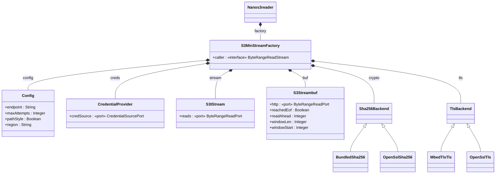
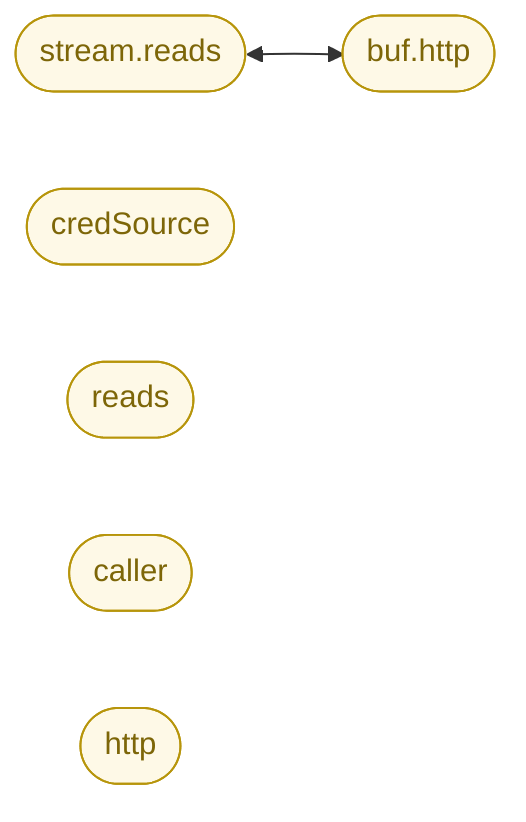
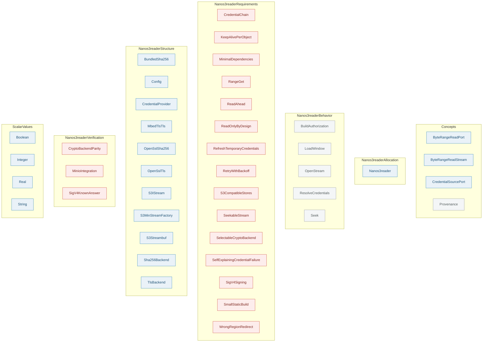
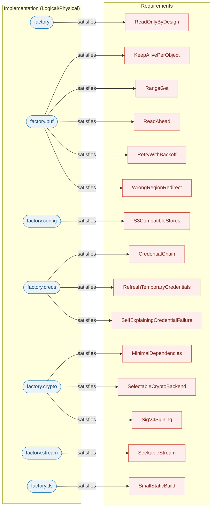

# nanos3reader — model diagrams

_Generated from the SysML knowledge graph by `tools/sysmldiag`. Do not hand-edit — re-run the generator._

## Contents

- [Requirements traceability](#requirements-traceability) — Which part satisfies which requirement, and which is verified.
- [Block definition diagram](#block-definition-diagram) — Part definitions, their attributes/ports, inheritance and composition.
- [Internal connections (IBD)](#internal-connections-ibd) — Ports and the connections wiring parts together.
- [Behavior (actions)](#behavior-actions) — Action decomposition and parameters.
- [Model map (packages)](#model-map-packages) — Every package and the definitions it contains, by RFLP layer.
- [Allocation (RFLP overview)](#allocation-rflp-overview) — Which implementation part realizes which requirement, across layers.

## Requirements traceability

Which part satisfies which requirement, and which is verified.

*Blue rounded = component, purple = verification case. Green requirement = verified, amber = satisfied-but-unverified, grey = orphan.*

```mermaid
flowchart LR
  classDef verified fill:#d5f5e3,stroke:#27ae60,color:#145a32;
  classDef partial  fill:#fdebd0,stroke:#e67e22,color:#7e5109;
  classDef orphan   fill:#f2f3f4,stroke:#85929e,color:#424949;
  classDef part     fill:#eaf2f8,stroke:#2980b9,color:#1b4f72;
  classDef vcase    fill:#f4ecf7,stroke:#8e44ad,color:#4a235a;
  P_factory(["factory"]):::part
  R_Nanos3readerRequirements__ReadOnlyByDesign["ReadOnlyByDesign"]:::partial
  P_factory -->|satisfies| R_Nanos3readerRequirements__ReadOnlyByDesign
  P_factory_buf(["factory.buf"]):::part
  R_Nanos3readerRequirements__KeepAlivePerObject["KeepAlivePerObject"]:::partial
  P_factory_buf -->|satisfies| R_Nanos3readerRequirements__KeepAlivePerObject
  R_Nanos3readerRequirements__RangeGet["RangeGet"]:::verified
  P_factory_buf -->|satisfies| R_Nanos3readerRequirements__RangeGet
  R_Nanos3readerRequirements__ReadAhead["ReadAhead"]:::verified
  P_factory_buf -->|satisfies| R_Nanos3readerRequirements__ReadAhead
  R_Nanos3readerRequirements__RetryWithBackoff["RetryWithBackoff"]:::partial
  P_factory_buf -->|satisfies| R_Nanos3readerRequirements__RetryWithBackoff
  R_Nanos3readerRequirements__WrongRegionRedirect["WrongRegionRedirect"]:::partial
  P_factory_buf -->|satisfies| R_Nanos3readerRequirements__WrongRegionRedirect
  P_factory_config(["factory.config"]):::part
  R_Nanos3readerRequirements__S3CompatibleStores["S3CompatibleStores"]:::verified
  P_factory_config -->|satisfies| R_Nanos3readerRequirements__S3CompatibleStores
  P_factory_creds(["factory.creds"]):::part
  R_Nanos3readerRequirements__CredentialChain["CredentialChain"]:::partial
  P_factory_creds -->|satisfies| R_Nanos3readerRequirements__CredentialChain
  R_Nanos3readerRequirements__RefreshTemporaryCredentials["RefreshTemporaryCredentials"]:::partial
  P_factory_creds -->|satisfies| R_Nanos3readerRequirements__RefreshTemporaryCredentials
  R_Nanos3readerRequirements__SelfExplainingCredentialFailure["SelfExplainingCredentialFailure"]:::partial
  P_factory_creds -->|satisfies| R_Nanos3readerRequirements__SelfExplainingCredentialFailure
  P_factory_crypto(["factory.crypto"]):::part
  R_Nanos3readerRequirements__MinimalDependencies["MinimalDependencies"]:::partial
  P_factory_crypto -->|satisfies| R_Nanos3readerRequirements__MinimalDependencies
  R_Nanos3readerRequirements__SelectableCryptoBackend["SelectableCryptoBackend"]:::verified
  P_factory_crypto -->|satisfies| R_Nanos3readerRequirements__SelectableCryptoBackend
  R_Nanos3readerRequirements__SigV4Signing["SigV4Signing"]:::verified
  P_factory_crypto -->|satisfies| R_Nanos3readerRequirements__SigV4Signing
  P_factory_stream(["factory.stream"]):::part
  R_Nanos3readerRequirements__SeekableStream["SeekableStream"]:::verified
  P_factory_stream -->|satisfies| R_Nanos3readerRequirements__SeekableStream
  P_factory_tls(["factory.tls"]):::part
  R_Nanos3readerRequirements__SmallStaticBuild["SmallStaticBuild"]:::partial
  P_factory_tls -->|satisfies| R_Nanos3readerRequirements__SmallStaticBuild
  V_Nanos3readerVerification__cryptoBackendParity[/"cryptoBackendParity"/]:::vcase
  V_Nanos3readerVerification__cryptoBackendParity -.->|verifies| R_Nanos3readerRequirements__SelectableCryptoBackend
  V_Nanos3readerVerification__minioIntegration[/"minioIntegration"/]:::vcase
  V_Nanos3readerVerification__minioIntegration -.->|verifies| R_Nanos3readerRequirements__RangeGet
  V_Nanos3readerVerification__minioIntegration -.->|verifies| R_Nanos3readerRequirements__ReadAhead
  V_Nanos3readerVerification__minioIntegration -.->|verifies| R_Nanos3readerRequirements__S3CompatibleStores
  V_Nanos3readerVerification__minioIntegration -.->|verifies| R_Nanos3readerRequirements__SeekableStream
  V_Nanos3readerVerification__sigv4KnownAnswer[/"sigv4KnownAnswer"/]:::vcase
  V_Nanos3readerVerification__sigv4KnownAnswer -.->|verifies| R_Nanos3readerRequirements__SigV4Signing
```

> ⚠️ 9 requirement(s) are satisfied but not verified (amber) — candidate gaps for new verification cases.

Source elements

| Element | Source |
|---|---|
| `CredentialChain` | `models/nanos3reader/requirements.sysml:54` |
| `KeepAlivePerObject` | `models/nanos3reader/requirements.sysml:36` |
| `MinimalDependencies` | `models/nanos3reader/requirements.sysml:106` |
| `RangeGet` | `models/nanos3reader/requirements.sysml:20` |
| `ReadAhead` | `models/nanos3reader/requirements.sysml:28` |
| `ReadOnlyByDesign` | `models/nanos3reader/requirements.sysml:132` |
| `RefreshTemporaryCredentials` | `models/nanos3reader/requirements.sysml:62` |
| `RetryWithBackoff` | `models/nanos3reader/requirements.sysml:96` |
| `S3CompatibleStores` | `models/nanos3reader/requirements.sysml:80` |
| `SeekableStream` | `models/nanos3reader/requirements.sysml:12` |
| `SelectableCryptoBackend` | `models/nanos3reader/requirements.sysml:114` |
| `SelfExplainingCredentialFailure` | `models/nanos3reader/requirements.sysml:70` |
| `SigV4Signing` | `models/nanos3reader/requirements.sysml:46` |
| `SmallStaticBuild` | `models/nanos3reader/requirements.sysml:122` |
| `WrongRegionRedirect` | `models/nanos3reader/requirements.sysml:88` |

## Block definition diagram

Part definitions, their attributes/ports, inheritance and composition.

*`<|--` = specialization (variant backend), `*--` = composition (owned part). «port»/«interface» tag connection points.*

Source elements

| Element | Source |
|---|---|
| `BundledSha256` | `models/nanos3reader/structure.sysml:20` |
| `Config` | `models/nanos3reader/structure.sysml:36` |
| `CredentialProvider` | `models/nanos3reader/structure.sysml:45` |
| `MbedTlsTls` | `models/nanos3reader/structure.sysml:30` |
| `Nanos3reader` | `models/nanos3reader/allocation.sysml:13` |
| `OpenSslSha256` | `models/nanos3reader/structure.sysml:16` |
| `OpenSslTls` | `models/nanos3reader/structure.sysml:27` |
| `S3IStream` | `models/nanos3reader/structure.sysml:61` |
| `S3MinStreamFactory` | `models/nanos3reader/structure.sysml:69` |
| `S3Streambuf` | `models/nanos3reader/structure.sysml:51` |
| `Sha256Backend` | `models/nanos3reader/structure.sysml:13` |
| `TlsBackend` | `models/nanos3reader/structure.sysml:26` |

## Internal connections (IBD)

Ports and the connections wiring parts together.

*Yellow = port/interface. `<-->` = a modeled connection.*

> ⚠️ 1 connection(s) across 4 declared port(s). Interconnection is under-modeled — add `connect` statements to complete the IBD.

Source elements

| Element | Source |
|---|---|
| `caller` | `models/nanos3reader/structure.sysml:91` |
| `credSource` | `models/nanos3reader/structure.sysml:48` |
| `http` | `models/nanos3reader/structure.sysml:58` |
| `reads` | `models/nanos3reader/structure.sysml:64` |

## Behavior (actions)

Action decomposition and parameters.

*Teal = action, grey rounded = parameter. Solid = sub-action.*

```mermaid
flowchart TD
  classDef act fill:#e8f8f5,stroke:#16a085,color:#0e6251;
  classDef param fill:#fdfefe,stroke:#aab7b8,color:#566573;
  A_Nanos3readerBehavior__BuildAuthorization["BuildAuthorization"]:::act
  PM_Nanos3readerBehavior__BuildAuthorization__authorizationHeader(["authorizationHeader"]):::param
  A_Nanos3readerBehavior__BuildAuthorization -.->|param| PM_Nanos3readerBehavior__BuildAuthorization__authorizationHeader
  PM_Nanos3readerBehavior__BuildAuthorization__canonicalRequest(["canonicalRequest"]):::param
  A_Nanos3readerBehavior__BuildAuthorization -.->|param| PM_Nanos3readerBehavior__BuildAuthorization__canonicalRequest
  PM_Nanos3readerBehavior__BuildAuthorization__credentials(["credentials"]):::param
  A_Nanos3readerBehavior__BuildAuthorization -.->|param| PM_Nanos3readerBehavior__BuildAuthorization__credentials
  A_Nanos3readerBehavior__LoadWindow["LoadWindow"]:::act
  PM_Nanos3readerBehavior__LoadWindow__credentials(["credentials"]):::param
  A_Nanos3readerBehavior__LoadWindow -.->|param| PM_Nanos3readerBehavior__LoadWindow__credentials
  PM_Nanos3readerBehavior__LoadWindow__reachedEof(["reachedEof"]):::param
  A_Nanos3readerBehavior__LoadWindow -.->|param| PM_Nanos3readerBehavior__LoadWindow__reachedEof
  PM_Nanos3readerBehavior__LoadWindow__start(["start"]):::param
  A_Nanos3readerBehavior__LoadWindow -.->|param| PM_Nanos3readerBehavior__LoadWindow__start
  PM_Nanos3readerBehavior__LoadWindow__window(["window"]):::param
  A_Nanos3readerBehavior__LoadWindow -.->|param| PM_Nanos3readerBehavior__LoadWindow__window
  A_Nanos3readerBehavior__OpenStream["OpenStream"]:::act
  A_Nanos3readerBehavior__OpenStream__firstLoad["firstLoad"]:::act
  A_Nanos3readerBehavior__OpenStream --> A_Nanos3readerBehavior__OpenStream__firstLoad
  PM_Nanos3readerBehavior__OpenStream__readAheadBytes(["readAheadBytes"]):::param
  A_Nanos3readerBehavior__OpenStream -.->|param| PM_Nanos3readerBehavior__OpenStream__readAheadBytes
  A_Nanos3readerBehavior__OpenStream__resolve["resolve"]:::act
  A_Nanos3readerBehavior__OpenStream --> A_Nanos3readerBehavior__OpenStream__resolve
  PM_Nanos3readerBehavior__OpenStream__stream(["stream"]):::param
  A_Nanos3readerBehavior__OpenStream -.->|param| PM_Nanos3readerBehavior__OpenStream__stream
  PM_Nanos3readerBehavior__OpenStream__uri(["uri"]):::param
  A_Nanos3readerBehavior__OpenStream -.->|param| PM_Nanos3readerBehavior__OpenStream__uri
  A_Nanos3readerBehavior__ResolveCredentials["ResolveCredentials"]:::act
  PM_Nanos3readerBehavior__ResolveCredentials__credentials(["credentials"]):::param
  A_Nanos3readerBehavior__ResolveCredentials -.->|param| PM_Nanos3readerBehavior__ResolveCredentials__credentials
  PM_Nanos3readerBehavior__ResolveCredentials__diagnostic(["diagnostic"]):::param
  A_Nanos3readerBehavior__ResolveCredentials -.->|param| PM_Nanos3readerBehavior__ResolveCredentials__diagnostic
  A_Nanos3readerBehavior__Seek["Seek"]:::act
  PM_Nanos3readerBehavior__Seek__position(["position"]):::param
  A_Nanos3readerBehavior__Seek -.->|param| PM_Nanos3readerBehavior__Seek__position
  PM_Nanos3readerBehavior__Seek__target(["target"]):::param
  A_Nanos3readerBehavior__Seek -.->|param| PM_Nanos3readerBehavior__Seek__target
```

> ⚠️ Execution order (succession/flow) is not modeled yet — edges show containment/parameters only. Add `then`/`succession` to get a true flow.

Source elements

| Element | Source |
|---|---|
| `BuildAuthorization` | `models/nanos3reader/behavior.sysml:22` |
| `LoadWindow` | `models/nanos3reader/behavior.sysml:30` |
| `OpenStream` | `models/nanos3reader/behavior.sysml:53` |
| `ResolveCredentials` | `models/nanos3reader/behavior.sysml:8` |
| `Seek` | `models/nanos3reader/behavior.sysml:46` |
| `firstLoad` | `models/nanos3reader/behavior.sysml:65` |
| `resolve` | `models/nanos3reader/behavior.sysml:64` |

## Model map (packages)

Every package and the definitions it contains, by RFLP layer.

*Colour = RFLP layer. Definitions per layer — Requirements: 18, Logical: 19.*

Source elements

| Element | Source |
|---|---|
| `Boolean` | `lib/scalar_values.sysml:12` |
| `BuildAuthorization` | `models/nanos3reader/behavior.sysml:22` |
| `BundledSha256` | `models/nanos3reader/structure.sysml:20` |
| `ByteRangeReadPort` | `lib/concepts.sysml:27` |
| `ByteRangeReadStream` | `lib/concepts.sysml:31` |
| `Config` | `models/nanos3reader/structure.sysml:36` |
| `CredentialChain` | `models/nanos3reader/requirements.sysml:54` |
| `CredentialProvider` | `models/nanos3reader/structure.sysml:45` |
| `CredentialSourcePort` | `lib/concepts.sysml:39` |
| `CryptoBackendParity` | `models/nanos3reader/verification.sysml:40` |
| `Integer` | `lib/scalar_values.sysml:11` |
| `KeepAlivePerObject` | `models/nanos3reader/requirements.sysml:36` |
| `LoadWindow` | `models/nanos3reader/behavior.sysml:30` |
| `MbedTlsTls` | `models/nanos3reader/structure.sysml:30` |
| `MinimalDependencies` | `models/nanos3reader/requirements.sysml:106` |
| `MinioIntegration` | `models/nanos3reader/verification.sysml:22` |
| `Nanos3reader` | `models/nanos3reader/allocation.sysml:13` |
| `OpenSslSha256` | `models/nanos3reader/structure.sysml:16` |
| `OpenSslTls` | `models/nanos3reader/structure.sysml:27` |
| `OpenStream` | `models/nanos3reader/behavior.sysml:53` |
| `Provenance` | `lib/concepts.sysml:15` |
| `RangeGet` | `models/nanos3reader/requirements.sysml:20` |
| `ReadAhead` | `models/nanos3reader/requirements.sysml:28` |
| `ReadOnlyByDesign` | `models/nanos3reader/requirements.sysml:132` |
| `Real` | `lib/scalar_values.sysml:10` |
| `RefreshTemporaryCredentials` | `models/nanos3reader/requirements.sysml:62` |
| `ResolveCredentials` | `models/nanos3reader/behavior.sysml:8` |
| `RetryWithBackoff` | `models/nanos3reader/requirements.sysml:96` |
| `S3CompatibleStores` | `models/nanos3reader/requirements.sysml:80` |
| `S3IStream` | `models/nanos3reader/structure.sysml:61` |
| `S3MinStreamFactory` | `models/nanos3reader/structure.sysml:69` |
| `S3Streambuf` | `models/nanos3reader/structure.sysml:51` |
| `Seek` | `models/nanos3reader/behavior.sysml:46` |
| `SeekableStream` | `models/nanos3reader/requirements.sysml:12` |
| `SelectableCryptoBackend` | `models/nanos3reader/requirements.sysml:114` |
| `SelfExplainingCredentialFailure` | `models/nanos3reader/requirements.sysml:70` |
| `Sha256Backend` | `models/nanos3reader/structure.sysml:13` |
| `SigV4KnownAnswer` | `models/nanos3reader/verification.sysml:11` |
| `SigV4Signing` | `models/nanos3reader/requirements.sysml:46` |
| `SmallStaticBuild` | `models/nanos3reader/requirements.sysml:122` |
| `String` | `lib/scalar_values.sysml:9` |
| `TlsBackend` | `models/nanos3reader/structure.sysml:26` |
| `WrongRegionRedirect` | `models/nanos3reader/requirements.sysml:88` |

## Allocation (RFLP overview)

Which implementation part realizes which requirement, across layers.

*Red = requirement, blue = implementing part. Arrow = satisfies.*

> ⚠️ 15 satisfy link(s) binding parts to 15 requirement(s).

Source elements

| Element | Source |
|---|---|
| `CredentialChain` | `models/nanos3reader/requirements.sysml:54` |
| `KeepAlivePerObject` | `models/nanos3reader/requirements.sysml:36` |
| `MinimalDependencies` | `models/nanos3reader/requirements.sysml:106` |
| `RangeGet` | `models/nanos3reader/requirements.sysml:20` |
| `ReadAhead` | `models/nanos3reader/requirements.sysml:28` |
| `ReadOnlyByDesign` | `models/nanos3reader/requirements.sysml:132` |
| `RefreshTemporaryCredentials` | `models/nanos3reader/requirements.sysml:62` |
| `RetryWithBackoff` | `models/nanos3reader/requirements.sysml:96` |
| `S3CompatibleStores` | `models/nanos3reader/requirements.sysml:80` |
| `SeekableStream` | `models/nanos3reader/requirements.sysml:12` |
| `SelectableCryptoBackend` | `models/nanos3reader/requirements.sysml:114` |
| `SelfExplainingCredentialFailure` | `models/nanos3reader/requirements.sysml:70` |
| `SigV4Signing` | `models/nanos3reader/requirements.sysml:46` |
| `SmallStaticBuild` | `models/nanos3reader/requirements.sysml:122` |
| `WrongRegionRedirect` | `models/nanos3reader/requirements.sysml:88` |

