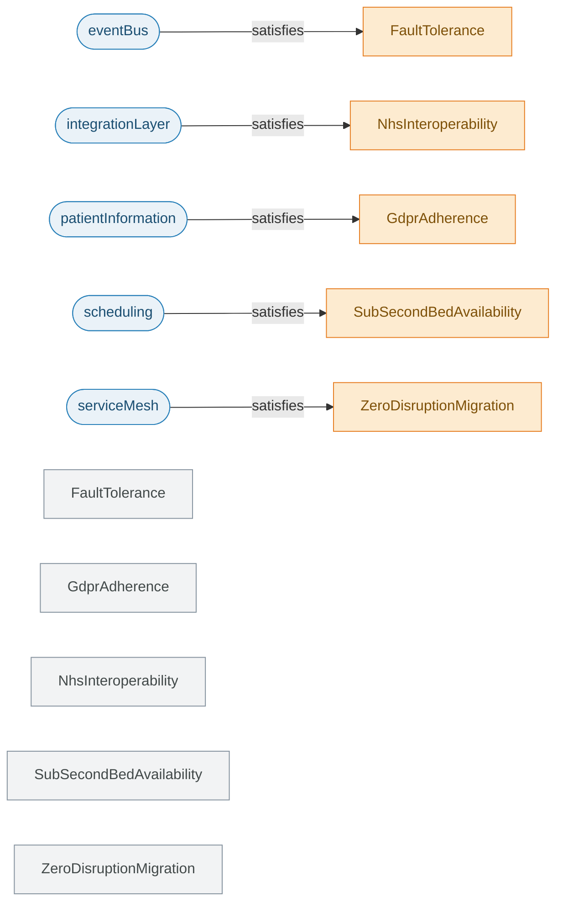
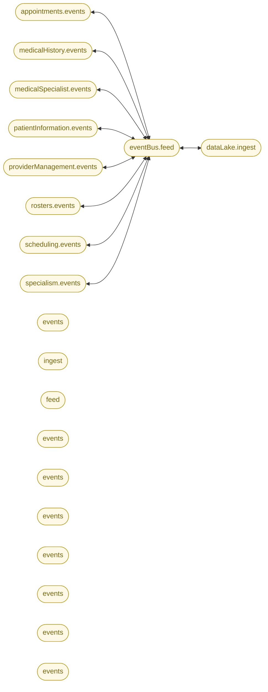
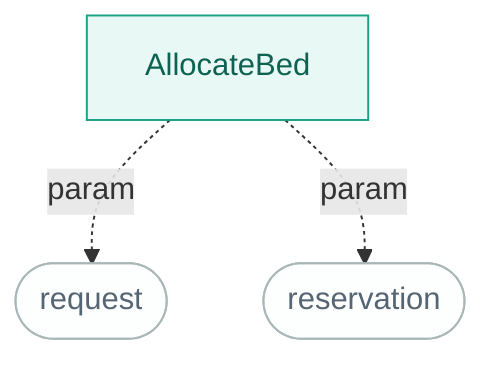
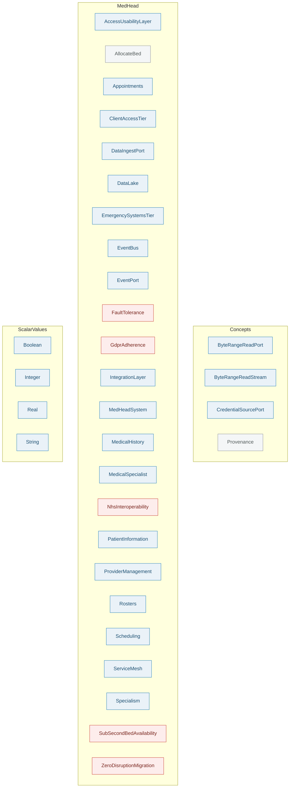
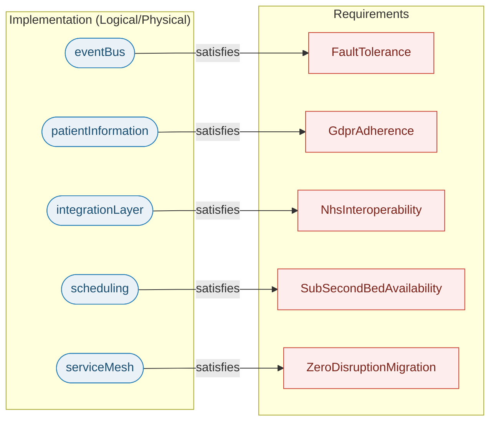

# MedHead — model diagrams

_Generated from the SysML knowledge graph by `tools/sysmldiag`. Do not hand-edit — re-run the generator._

## Contents

- [Requirements traceability](#requirements-traceability) — Which part satisfies which requirement, and which is verified.
- [Block definition diagram](#block-definition-diagram) — Part definitions, their attributes/ports, inheritance and composition.
- [Internal connections (IBD)](#internal-connections-ibd) — Ports and the connections wiring parts together.
- [Behavior (actions)](#behavior-actions) — Action decomposition and parameters.
- [Model map (packages)](#model-map-packages) — Every package and the definitions it contains, by RFLP layer.
- [Allocation (RFLP overview)](#allocation-rflp-overview) — Which implementation part realizes which requirement, across layers.

## Requirements traceability

Which part satisfies which requirement, and which is verified.

*Blue rounded = component, purple = verification case. Green requirement = verified, amber = satisfied-but-unverified, grey = orphan.*

[View as SVG](svg/requirements.svg)

> ⚠️ 5 requirement(s) are satisfied but not verified (amber) — candidate gaps for new verification cases.
> ⚠️ 5 requirement(s) are neither satisfied nor verified (grey).

Source elements

| Element | Source |
|---|---|
| `FaultTolerance` | `tools/sysmldiag/ingest_eval/medhead/expected/medhead.sysml:24` |
| `GdprAdherence` | `tools/sysmldiag/ingest_eval/medhead/expected/medhead.sysml:18` |
| `NhsInteroperability` | `tools/sysmldiag/ingest_eval/medhead/expected/medhead.sysml:12` |
| `SubSecondBedAvailability` | `tools/sysmldiag/ingest_eval/medhead/expected/medhead.sysml:36` |
| `ZeroDisruptionMigration` | `tools/sysmldiag/ingest_eval/medhead/expected/medhead.sysml:30` |

## Block definition diagram

Part definitions, their attributes/ports, inheritance and composition.

*`<|--` = specialization (variant backend), `*--` = composition (owned part). «port»/«interface» tag connection points.*

[View as SVG](svg/bdd.svg)

```mermaid
classDiagram
  class AccessUsabilityLayer["AccessUsabilityLayer"] {
    +accessControl : String
    +userInterfaces : String
  }
  class Appointments["Appointments"] {
    +bookingRecords : String
    +events : «port» EventPort
  }
  class ClientAccessTier["ClientAccessTier"] {
    +clientEndpoints : String
  }
  class DataLake["DataLake"] {
    +analyticsData : String
    +ingest : «port» DataIngestPort
  }
  class EmergencySystemsTier["EmergencySystemsTier"] {
    +emergencyProtocols : String
    +failoverMechanisms : String
  }
  class EventBus["EventBus"] {
    +eventTopics : String
    +feed : «port» EventPort
  }
  class IntegrationLayer["IntegrationLayer"] {
    +complianceFramework : String
    +externalIntegrations : String
  }
  class MedHeadSystem["MedHeadSystem"] {
  }
  class MedicalHistory["MedicalHistory"] {
    +clinicalRecords : String
    +events : «port» EventPort
  }
  class MedicalSpecialist["MedicalSpecialist"] {
    +events : «port» EventPort
    +practitionerId : String
    +specialisms : String
  }
  class PatientInformation["PatientInformation"] {
    +demographics : String
    +events : «port» EventPort
    +patientId : String
  }
  class ProviderManagement["ProviderManagement"] {
    +capabilities : String
    +events : «port» EventPort
    +providerId : String
  }
  class Rosters["Rosters"] {
    +events : «port» EventPort
    +onCallAssignments : String
    +rosterData : String
  }
  class Scheduling["Scheduling"] {
    +allocationStrategy : String
    +bedAvailability : String
    +events : «port» EventPort
  }
  class ServiceMesh["ServiceMesh"] {
    +proxyConfig : String
  }
  class Specialism["Specialism"] {
    +events : «port» EventPort
    +specialismCatalogue : String
  }
  MedHeadSystem *-- AccessUsabilityLayer : accessUsabilityLayer
  MedHeadSystem *-- Appointments : appointments
  MedHeadSystem *-- ClientAccessTier : clientAccessTier
  MedHeadSystem *-- DataLake : dataLake
  MedHeadSystem *-- EmergencySystemsTier : emergencySystemsTier
  MedHeadSystem *-- EventBus : eventBus
  MedHeadSystem *-- IntegrationLayer : integrationLayer
  MedHeadSystem *-- MedicalHistory : medicalHistory
  MedHeadSystem *-- MedicalSpecialist : medicalSpecialist
  MedHeadSystem *-- PatientInformation : patientInformation
  MedHeadSystem *-- ProviderManagement : providerManagement
  MedHeadSystem *-- Rosters : rosters
  MedHeadSystem *-- Scheduling : scheduling
  MedHeadSystem *-- ServiceMesh : serviceMesh
  MedHeadSystem *-- Specialism : specialism
```

Source elements

| Element | Source |
|---|---|
| `AccessUsabilityLayer` | `tools/sysmldiag/ingest_eval/medhead/expected/medhead.sysml:120` |
| `Appointments` | `tools/sysmldiag/ingest_eval/medhead/expected/medhead.sysml:83` |
| `ClientAccessTier` | `tools/sysmldiag/ingest_eval/medhead/expected/medhead.sysml:115` |
| `DataLake` | `tools/sysmldiag/ingest_eval/medhead/expected/medhead.sysml:103` |
| `EmergencySystemsTier` | `tools/sysmldiag/ingest_eval/medhead/expected/medhead.sysml:126` |
| `EventBus` | `tools/sysmldiag/ingest_eval/medhead/expected/medhead.sysml:97` |
| `IntegrationLayer` | `tools/sysmldiag/ingest_eval/medhead/expected/medhead.sysml:132` |
| `MedHeadSystem` | `tools/sysmldiag/ingest_eval/medhead/expected/medhead.sysml:146` |
| `MedicalHistory` | `tools/sysmldiag/ingest_eval/medhead/expected/medhead.sysml:50` |
| `MedicalSpecialist` | `tools/sysmldiag/ingest_eval/medhead/expected/medhead.sysml:62` |
| `PatientInformation` | `tools/sysmldiag/ingest_eval/medhead/expected/medhead.sysml:43` |
| `ProviderManagement` | `tools/sysmldiag/ingest_eval/medhead/expected/medhead.sysml:69` |
| `Rosters` | `tools/sysmldiag/ingest_eval/medhead/expected/medhead.sysml:89` |
| `Scheduling` | `tools/sysmldiag/ingest_eval/medhead/expected/medhead.sysml:76` |
| `ServiceMesh` | `tools/sysmldiag/ingest_eval/medhead/expected/medhead.sysml:109` |
| `Specialism` | `tools/sysmldiag/ingest_eval/medhead/expected/medhead.sysml:56` |

## Internal connections (IBD)

Ports and the connections wiring parts together.

*Yellow = port/interface. `<-->` = a modeled connection.*

[View as SVG](svg/ibd.svg)

> ⚠️ 9 connection(s) across 10 declared port(s). Interconnection is under-modeled — add `connect` statements to complete the IBD.

Source elements

| Element | Source |
|---|---|
| `events` | `tools/sysmldiag/ingest_eval/medhead/expected/medhead.sysml:48` |
| `events` | `tools/sysmldiag/ingest_eval/medhead/expected/medhead.sysml:54` |
| `events` | `tools/sysmldiag/ingest_eval/medhead/expected/medhead.sysml:60` |
| `events` | `tools/sysmldiag/ingest_eval/medhead/expected/medhead.sysml:67` |
| `events` | `tools/sysmldiag/ingest_eval/medhead/expected/medhead.sysml:74` |
| `events` | `tools/sysmldiag/ingest_eval/medhead/expected/medhead.sysml:81` |
| `events` | `tools/sysmldiag/ingest_eval/medhead/expected/medhead.sysml:87` |
| `events` | `tools/sysmldiag/ingest_eval/medhead/expected/medhead.sysml:94` |
| `feed` | `tools/sysmldiag/ingest_eval/medhead/expected/medhead.sysml:101` |
| `ingest` | `tools/sysmldiag/ingest_eval/medhead/expected/medhead.sysml:107` |

## Behavior (actions)

Action decomposition and parameters.

*Teal = action, grey rounded = parameter. Solid = sub-action.*

[View as SVG](svg/behavior.svg)

> ⚠️ Execution order (succession/flow) is not modeled yet — edges show containment/parameters only. Add `then`/`succession` to get a true flow.

Source elements

| Element | Source |
|---|---|
| `AllocateBed` | `tools/sysmldiag/ingest_eval/medhead/expected/medhead.sysml:139` |

## Model map (packages)

Every package and the definitions it contains, by RFLP layer.

*Colour = RFLP layer. Definitions per layer — Requirements: 5, Logical: 25.*

[View as SVG](svg/package_map.svg)

Source elements

| Element | Source |
|---|---|
| `AccessUsabilityLayer` | `tools/sysmldiag/ingest_eval/medhead/expected/medhead.sysml:120` |
| `AllocateBed` | `tools/sysmldiag/ingest_eval/medhead/expected/medhead.sysml:139` |
| `Appointments` | `tools/sysmldiag/ingest_eval/medhead/expected/medhead.sysml:83` |
| `Boolean` | `lib/scalar_values.sysml:12` |
| `ByteRangeReadPort` | `lib/concepts.sysml:27` |
| `ByteRangeReadStream` | `lib/concepts.sysml:31` |
| `ClientAccessTier` | `tools/sysmldiag/ingest_eval/medhead/expected/medhead.sysml:115` |
| `CredentialSourcePort` | `lib/concepts.sysml:39` |
| `DataIngestPort` | `tools/sysmldiag/ingest_eval/medhead/expected/medhead.sysml:10` |
| `DataLake` | `tools/sysmldiag/ingest_eval/medhead/expected/medhead.sysml:103` |
| `EmergencySystemsTier` | `tools/sysmldiag/ingest_eval/medhead/expected/medhead.sysml:126` |
| `EventBus` | `tools/sysmldiag/ingest_eval/medhead/expected/medhead.sysml:97` |
| `EventPort` | `tools/sysmldiag/ingest_eval/medhead/expected/medhead.sysml:9` |
| `FaultTolerance` | `tools/sysmldiag/ingest_eval/medhead/expected/medhead.sysml:24` |
| `GdprAdherence` | `tools/sysmldiag/ingest_eval/medhead/expected/medhead.sysml:18` |
| `Integer` | `lib/scalar_values.sysml:11` |
| `IntegrationLayer` | `tools/sysmldiag/ingest_eval/medhead/expected/medhead.sysml:132` |
| `MedHeadSystem` | `tools/sysmldiag/ingest_eval/medhead/expected/medhead.sysml:146` |
| `MedicalHistory` | `tools/sysmldiag/ingest_eval/medhead/expected/medhead.sysml:50` |
| `MedicalSpecialist` | `tools/sysmldiag/ingest_eval/medhead/expected/medhead.sysml:62` |
| `NhsInteroperability` | `tools/sysmldiag/ingest_eval/medhead/expected/medhead.sysml:12` |
| `PatientInformation` | `tools/sysmldiag/ingest_eval/medhead/expected/medhead.sysml:43` |
| `Provenance` | `lib/concepts.sysml:15` |
| `ProviderManagement` | `tools/sysmldiag/ingest_eval/medhead/expected/medhead.sysml:69` |
| `Real` | `lib/scalar_values.sysml:10` |
| `Rosters` | `tools/sysmldiag/ingest_eval/medhead/expected/medhead.sysml:89` |
| `Scheduling` | `tools/sysmldiag/ingest_eval/medhead/expected/medhead.sysml:76` |
| `ServiceMesh` | `tools/sysmldiag/ingest_eval/medhead/expected/medhead.sysml:109` |
| `Specialism` | `tools/sysmldiag/ingest_eval/medhead/expected/medhead.sysml:56` |
| `String` | `lib/scalar_values.sysml:9` |
| `SubSecondBedAvailability` | `tools/sysmldiag/ingest_eval/medhead/expected/medhead.sysml:36` |
| `ZeroDisruptionMigration` | `tools/sysmldiag/ingest_eval/medhead/expected/medhead.sysml:30` |

## Allocation (RFLP overview)

Which implementation part realizes which requirement, across layers.

*Red = requirement, blue = implementing part. Arrow = satisfies.*

[View as SVG](svg/allocation.svg)

> ⚠️ 5 satisfy link(s) binding parts to 5 requirement(s).

Source elements

| Element | Source |
|---|---|
| `FaultTolerance` | `tools/sysmldiag/ingest_eval/medhead/expected/medhead.sysml:24` |
| `GdprAdherence` | `tools/sysmldiag/ingest_eval/medhead/expected/medhead.sysml:18` |
| `NhsInteroperability` | `tools/sysmldiag/ingest_eval/medhead/expected/medhead.sysml:12` |
| `SubSecondBedAvailability` | `tools/sysmldiag/ingest_eval/medhead/expected/medhead.sysml:36` |
| `ZeroDisruptionMigration` | `tools/sysmldiag/ingest_eval/medhead/expected/medhead.sysml:30` |

